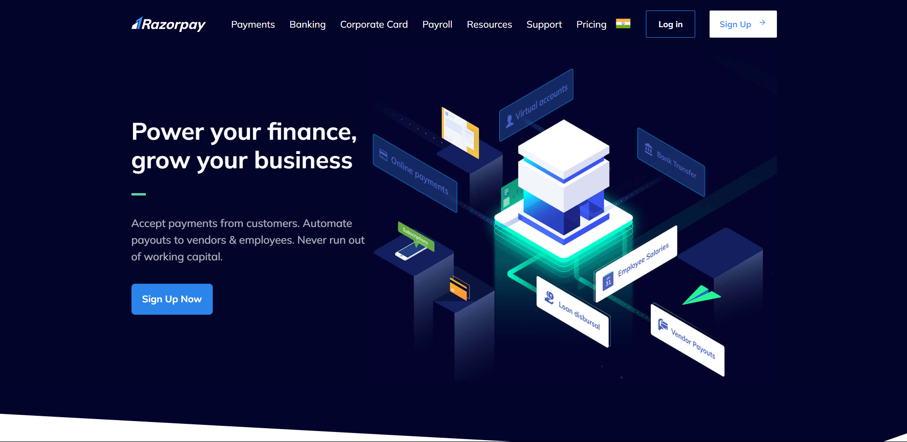

# 💳 Razorpay Clone

A fully responsive frontend clone of the Razorpay payment gateway, designed with HTML and Tailwind CSS. This project aims to replicate the sleek and modern user interface of Razorpay's payment platform, showcasing clean design and responsive functionality.

## 🎯 Features

- **Pixel-Perfect Design**: Crafted to closely mirror the Razorpay user interface with attention to detail.
- **Fully Responsive**: Designed to work seamlessly across various devices, including desktops, tablets, and mobile phones.
- **Clean and Modern Aesthetics**: Focuses on delivering a visually appealing and user-friendly experience.

## 📸 Screenshots

<p align="center">
  
</p>

<p align="center"><em>Experience the sleek and professional design of the Razorpay payment gateway clone.</em></p>

## 🚀 Getting Started

To get a local copy up and running, follow these simple steps:

### Prerequisites

Make sure you have the following installed:

- A modern web browser (Chrome, Firefox, Edge, etc.)
- A code editor (VSCode, Sublime Text, etc.)

### Installation

1. **Clone the repository:**

    ```bash
    git clone https://github.com/divyanshdangi11/razorpay-clone.git
    ```

2. **Navigate to the project directory:**

    ```bash
    cd razorpay-clone
    ```

3. **Open `index.html` in your browser:**

    ```bash
    open index.html
    ```
    Or simply drag the `index.html` file into your browser.

## 🛠️ Built With

- **HTML** - Structure the app’s content.
- **Tailwind CSS** - Apply styling and responsiveness for a modern look and feel.

## 💡 How It Works

1. **Responsive Layouts**: The design adjusts seamlessly to different screen sizes and devices.
2. **Modern UI**: Emulates the Razorpay payment interface, providing a realistic and professional appearance.
3. **No Backend Integration**: This is a frontend-only clone; it does not include backend functionalities or payment processing.

## 🌍 Contributing

Contributions are welcome! If you have suggestions or improvements, please feel free to contribute.

1. **Fork the Project**
2. **Create your Feature Branch** (`git checkout -b feature/AmazingFeature`)
3. **Commit your Changes** (`git commit -m 'Add some AmazingFeature'`)
4. **Push to the Branch** (`git push origin feature/AmazingFeature`)
5. **Open a Pull Request**

## 📜 License

Distributed under the MIT License. See `LICENSE` for more information.

## 📧 Contact

**Name** - Divyansh Dangi  
**Email** - ddangi_be21@thapar.edu  
**Project Live Link** - [Razorpay Clone](https://divyansh-dangi-razorpay-clone.netlify.app/)  
**Portfolio** - [Divyansh's Portfolio](https://divyansh-dangi-portfolio.netlify.app/)
